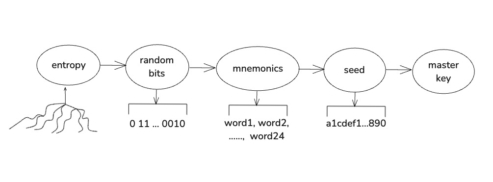

# Key Generation Process

## 1.From Entropy to Mnemonics

- What's entropy?

    Entropy in the context of Bitcoin and cryptography refers to the randomness collected from physical processes. This randomness is used to generate a sequence of random bits, which is crucial for creating secure cryptographic keys. In Bitcoin, entropy is used as the starting point for generating a mnemonic phrase.

- What's mnemonics?

    Mnemonics are a set of words used as a human-readable representation of binary data, specifically the entropy. In Bitcoin, mnemonics are usually a list of 12, 18, or 24 words that can be used to generate a seed, which in turn generates private keys for a wallet. Mnemonics make it easier for users to back up and restore their wallets.

## 2. From Mnemonics to Seed

- What's seed?

    A seed is a 512-bit number generated from a mnemonic phrase using a key-stretching function (like PBKDF2). This seed is the root from which all private and public keys for a wallet are derived.

 - How does BIP 39 provide a method for generating mnemonic seeds?

    BIP 39 (Bitcoin Improvement Proposal 39) defines the process of generating a mnemonic phrase from entropy. It specifies the use of a predefined word list and a checksum to ensure the integrity of the mnemonic. The mnemonic is then converted into a seed using a password-based key derivation function (PBKDF2 with HMAC-SHA512).

## 3. From Seed to Master Key

- What's master key?

    A master key is the root private key in a hierarchical deterministic (HD) wallet. From this key, a tree of child keys can be derived. The master key is typically derived from the seed using HMAC-SHA512.

- What's HD wallet?

    An HD wallet (Hierarchical Deterministic wallet) is a type of wallet that generates a tree of keys from a single seed. This allows for the generation of many addresses and private keys from one seed, enabling easier backup and key management.

- How does BIP32 define the HD wallet structure?

    BIP 32 defines the standard for HD wallets, specifying how to generate a tree of keys from a master key. It uses a derivation path and a combination of HMAC-SHA512 to derive child keys from the master key. BIP 32 allows for the creation of both public and private key chains, enabling the generation of addresses without exposing private keys.

## 4. From Master Key to Address

- How does BIP44 establish a standard derivation path for legacy Bitcoin addresses?
    
  BIP 44 (Bitcoin Improvement Proposal 44) defines a standard derivation path for HD wallets to generate Bitcoin addresses. It specifies a hierarchical structure that organizes keys by purpose, coin type, account, change, and index, ensuring consistent address generation for legacy Bitcoin (P2PKH) addresses. This standard allows multiple wallets to be derived from a single seed phrase, making key management and recovery easier across platforms.
